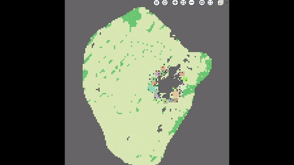

# SahelFluxCID

## Context
Model developped for the 3rd [CID](www.ci-durable.org) held in Dakar, on November 2021.
[Related poster](./Showcase/CID2021-Poster119.pdf) (French)

## Specifications
Using [GAMA Platform](https://gama-platform.org/) v. 1.8.2 (developper build [ff11705a](https://github.com/gama-platform/gama/releases)).

To run the model, launch from `main.gaml`. To run sensivity analysis, launch from `batch.gaml`.
Random numbers lists used for the poster are included as a CSV file in `./includes/`. New lists and afferent Gini indexex can be generated using `GenerGini.gaml`

## References cited in the code :
Achard, F., Banoin, M., 2003. Fallows, forage production and nutrient transfers by livestock in Niger. Nutrient Cycling in Agroecosystems 7.

Audouin, E., Odru, M., Vayssières, J., Masse, D., Lecomte, P., 2014. Reintroducing livestock to improve village-scale agricultural productivity, nutrient balance and nutrient use effciency: the case of Senegalese groundnut basin.

Balandier, M.-L., 2017. Describing diversity and crop-livestock integration in smallholder mixed farming systems in Sub-Saharan Africa: An application of network analysis in the former Senegalese Groundnut Basin (Master 2). Wageningen University, Wageningen.

Chirat, G., Groot, J.C.J., Messad, S., Bocquier, F., Ickowicz, A., 2014. Instantaneous intake rate of free-grazing cattle as affected by herbage characteristics in heterogeneous tropical agro-pastoral landscapes. Applied Animal Behaviour Science 157, 48–60. [https://doi.org/10.1016/j.applanim.2014.06.003](https://doi.org/10.1016/j.applanim.2014.06.003)

Gersie, S., 2020. Predicting Cattle Grazing Distributions: An Agent-Based Modeling Approach (MSc Thesis). Colorado State University.

Grange, G., 2015. Suivi du cycle de l’azote en fermes réelles : Cas des systèmes agropastoraux du bassin arachidier du Sénégal (Ingénieur agronome - Master 2). Montpellier SupAgro, Montpellier.

Grillot, M., Guerrin, F., Gaudou, B., Masse, D., Vayssières, J., 2018. Multi-level analysis of nutrient cycling within agro-sylvo-pastoral landscapes in West Africa using an agent-based model. Environmental Modelling & Software 107, 267–280. [https://doi.org/10.1016/j.envsoft.2018.05.003](https://doi.org/10.1016/j.envsoft.2018.05.003)

INRA, 2018. L’alimentation des ruminants.

Latham, L.G., 2006. Network flow analysis algorithms. Ecological Modelling 192, 586–600. [https://doi.org/10.1016/j.ecolmodel.2005.07.029](https://doi.org/10.1016/j.ecolmodel.2005.07.029)

Stark, F., Vayssières, J., Vigne, M., García, E.G., Moulin, C.-H., 2016. Ecological network analysis used to assess the agroecological properties of farming systems, in: EcoSummit 2016 Ecological Sustainability: Engineering Change. p. np.

Wade, C., 2016. Analyse des flux d’azote en milieu paysan : Cas des systèmes agropastoraux du bassin arachidier du Sénégal (Ingénieur agronome - Master 2). Ecole Nationale Supérieure d’Agriculture de Thies, Thies, Sénégal.

Zampaligré, N., Schlecht, E., 2018. Livestock foraging behaviour on different land use classes along the semi-arid to sub-humid agro-ecological gradient in West Africa. Environ Dev Sustain 20, 731–748. [https://doi.org/10.1007/s10668-017-9907-y](https://doi.org/10.1007/s10668-017-9907-y)

